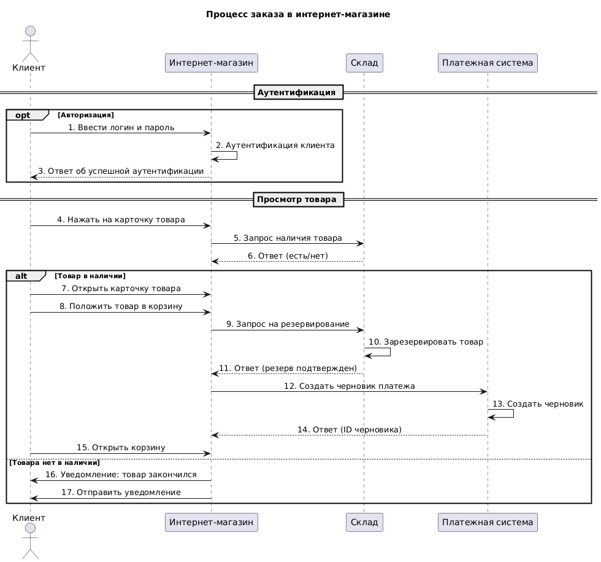
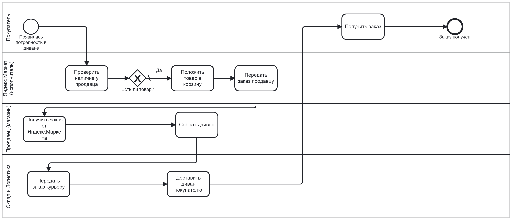

# Аналитика процессов: UML + BPMN 

---

Analytics_practice/
│
├── 1_uml_diagrams/                           # Раздел 1: UML диаграммы
│   │
│   ├── 1.3_shop_sequence/                    # Задание 1.3 — перерисованная диаграмма
│   │   ├── diagram.puml                      # Исходник PlantUML
│   │   └── diagram.png                        # Готовая диаграмма
│   │
│   └── 1.4_custom_scenario/                   # Задание 1.4 — авторская диаграмма
│       ├── payment.puml                        # Исходник с 3+ фреймами
│       └── payment.png                          # Визуализация процесса оплаты с кэшбэком
│
├── 2_bpmn/                                     # Раздел 2: BPMN моделирование
│   │
│   ├── 2.1_definition/                          # Задание 2.1 — теория
│   │   └── README.md                             # Определение БП и 3 примера из разных сфер
│   │
│   └── 2.5_yandex_market/                        # Задание 2.5 — практический кейс
│       ├── divan_order.bpmn                       # Файл Camunda Modeler
│       └── divan_order.png                         # Скриншот BPMN-диаграммы
│
├── .gitignore                                    # Служебный файл Git
└── README.md                                     # Основной файл

---

## 🛒 1. UML: Диаграммы последовательности

### 1.3 Перерисованная диаграмма (интернет-магазин)

Классический сценарий заказа товара:  
**Клиент → Интернет-магазин → Склад → Платежная система**



🔗 [Исходник PlantUML](1_uml_diagrams/1.3_shop_sequence/diagram.puml)

**Использованные элементы:**
- `opt` — авторизация
- `alt` — проверка наличия товара
- 4 участника

---

### 1.4 Авторская диаграмма: Оплата с кэшбэком (Тинькофф)

Сценарий оплаты заказа с использованием бонусной программы.  
Реализованы **3+ фрейма** и **4+ участника**.


🔗 [Исходник PlantUML](1_uml_diagrams/1.4_custom_scenario/payment.puml)

**Использованные фреймы:**
- `group` — оплата картой
- `loop` — повтор при ошибке ввода CVV
- `alt` — успех/ошибка оплаты
- `opt` — начисление кэшбэка (при сумме > 1000 ₽)

---

## ⚙️ 2. BPMN: Бизнес-процессы

### 2.1 Что такое бизнес-процесс?

**Бизнес-процесс** — это повторяемая последовательность действий, в ходе которой ресурсы на входе преобразуются в конкретный результат на выходе. У каждого процесса есть чёткие границы: начало (триггер), шаги, участники, правила и результат.

**Примеры из разных сфер:**

#### 1. 🛍 Ритейл (Ozon) — Возврат товара

| Элемент | Описание |
|--------|----------|
| **Вход** | Неподходящая вещь + чек |
| **Действия** | Заявка в приложении → Одобрение возврата → Приёмка товара → Перевод денег |
| **Участники** | Покупатель, поддержка Ozon, склад, бухгалтерия |
| **Выход** | Деньги на карте покупателя |

#### 2. 🚕 Такси (Яндекс.Такси) — Поездка

| Элемент | Описание |
|--------|----------|
| **Вход** | Точка А и точка Б |
| **Действия** | Поиск водителя → Подача машины → Поездка → Оплата |
| **Участники** | Пассажир, водитель, алгоритмы Яндекса |
| **Выход** | Пассажир доставлен, деньги списаны |

#### 3. 🏥 Медицина — Запись к врачу

| Элемент | Описание |
|--------|----------|
| **Вход** | Желание пациента попасть на приём |
| **Действия** | Выбор специалиста → Выбор свободного времени → Подтверждение записи |
| **Участники** | Пациент, регистратура, врач |
| **Выход** | Подтверждённый талон на конкретное время |

📖 [Подробнее в файле](2_bpmn/2.1_definition/README.md)

---

### 2.5 Модель процесса: Заказ дивана на Яндекс Маркете

Процесс смоделирован в **Camunda Modeler** с использованием:
- **4 дорожек (пулов):** Покупатель, Яндекс Маркет, Продавец, Склад и Логистика
- **Шлюза:** проверка наличия товара
- **Полного цикла:** от потребности до получения заказа



**Описание процесса по дорожкам:**

| Дорожка | Действия |
|---------|----------|
| **Покупатель** | Повысить потребность в диване |
| **Яндекс Маркет (исполнитель)** | Проверить наличие у продавца → Есть ли товар? (шлюз) → Положить товар в корзину → Передать заказ продавцу |
| **Продавец (магазин)** | Получить заказ от Яндекс.Маркета → Собрать диван → Доставить диван покупателю |
| **Склад и Логистика** | Передать заказ курьеру |

🔗 [Скачать .bpmn файл](2_bpmn/2.5_yandex_market/divan_order.bpmn)

---

## 🚀 Как работать с репозиторием

### Для просмотра диаграмм:
- **PNG** — открываются прямо в браузере
- **PUML** — открой на [PlantUML Editor](https://www.plantuml.com/plantuml/uml/) или в VS Code с расширением PlantUML
- **BPMN** — открой в [Camunda Modeler](https://camunda.com/download/modeler/) или на [bpmn.io](https://demo.bpmn.io/)

### Клонирование репозитория:
```bash
git clone https://github.com/твой-логин/Analytics_practice.git
